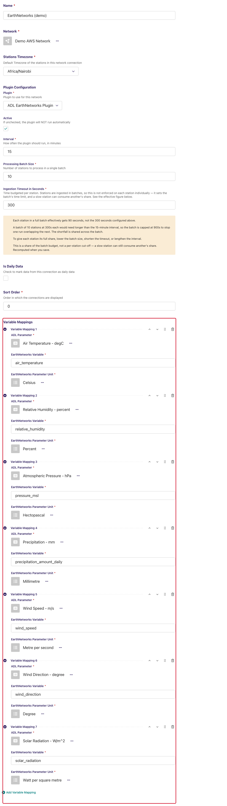
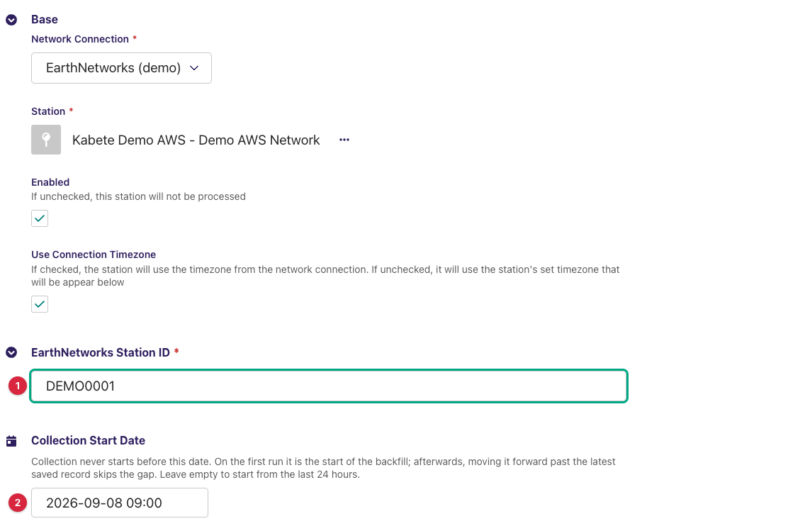
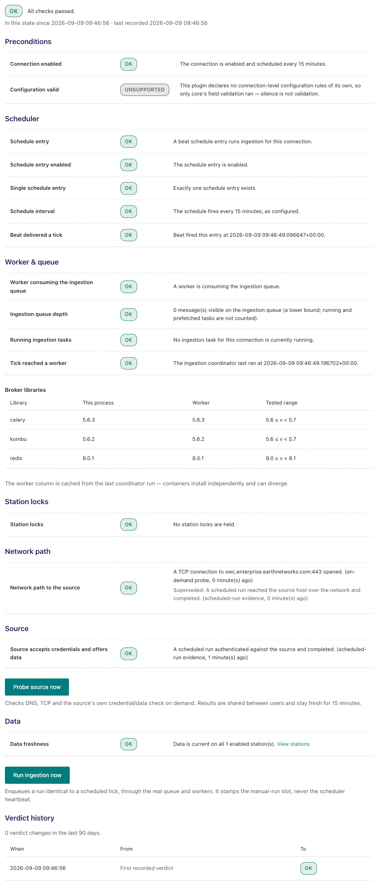
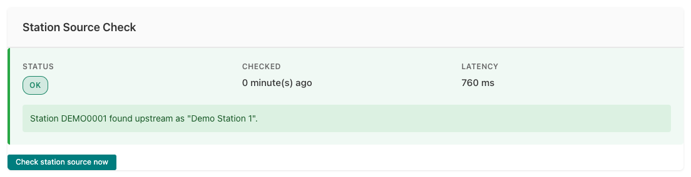

---
adl_plugin:
  name: ADL EarthNetworks Plugin
  connects_to: Earth Networks enterprise observations API
  category: general
  choose_when: Your stations are Earth Networks weather stations served through the Earth Networks enterprise data API.
---
# ADL EarthNetworks Plugin

Collects observation data from **Earth Networks** weather stations through
the **Earth Networks enterprise observations API** (`GetData.ashx`) and
saves it into an ADL instance. This is a *pull* plugin: on each collection
cycle ADL asks the API for the historical observations of each linked
station over a time window and stores the values of the fixed set of
variables the plugin extracts, mapped against your ADL stations and data
parameters.

**Repository:** [adl-earthnetworks-plugin](https://github.com/wmo-raf/adl-earthnetworks-plugin)
**Plugin type identifier:** `adl_earthnetworks_plugin`
**Connection model:** `EarthNetworksConnection` · **Station link model:** `EarthNetworksStationLink`

> **About the screenshots.** Every image in this guide is regenerated from
> `docs/screenshots.yml` against a seeded demo instance, so hostnames, station
> names, ids and readings in them are placeholders — not values to copy. The
> field tables are the reference for what to enter.

## Overview

The Earth Networks API answers one kind of request: *the historical
observations of station S between two instants*, returned as a list of
observation bundles, each carrying the station's identity and a set of
named readings (`TemperatureC`, `Humidity`, `PressureSeaLevelMBar`,
`WindSpeedKph`, …). The plugin does not expose those raw names. It
**normalises** every bundle into a record with a fixed set of keys in
metric units, and it is those keys that variable mappings refer to:

| Record key (*EarthNetworks Variable*) | Source field | Unit as delivered |
|---|---|---|
| `air_temperature` | `TemperatureC` | °C |
| `relative_humidity` | `Humidity` | % |
| `pressure_msl` | `PressureSeaLevelMBar` | hPa (mbar) |
| `wind_speed` | `WindSpeedKph`, converted | m/s |
| `wind_direction` | `WindDirectionDegrees` | degrees |
| `precipitation_amount_daily` | `RainMillimetersDaily` — the running total since local midnight, not an interval amount | mm |
| `wind_gust` | `WindGustKphHourly` — the last hour's maximum, converted | m/s |
| `dew_point` | `DewPointC` | °C |
| `wet_bulb_temperature` | `WetBulbTemperatureC` | °C |
| `visibility` | `VisibilityKilometers` | km |
| `altimeter` | `AltimeterMBar` | hPa (mbar) |
| `solar_radiation` | `SolarIrradiance` | W/m² |

A reading the station does not report is simply absent from the record.
Because the keys are the same for every station, variable mappings live on
the **connection** and apply to every station linked under it.

The API host, provider id and unit system (metric) are fixed in the plugin;
the connection holds nothing but the mappings. The plugin sends **no
credential**: whatever access control Earth Networks applies to your
enterprise endpoint (typically allow-listing of the calling address) must be
arranged with them for the ADL host.

## Prerequisites

- A running ADL instance (see [Installation](https://adl-tool.readthedocs.io/en/latest/installation.html)).
- An **Earth Networks enterprise data agreement** covering the stations to
  collect, with API access enabled for the ADL host's public address — the
  plugin sends no key or password, so a host Earth Networks does not
  recognise receives an error page, not data. Earth Networks provides the
  **station ids** to use.
- Outbound HTTPS (port 443) from the ADL host to
  `owc.enterprise.earthnetworks.com`.

## Installation

Installed like any ADL plugin — see [Plugin Installation](https://adl-tool.readthedocs.io/en/latest/developer_guide/plugins/plugin_installation.html) for
all methods. The `plugins.toml` entry:

```toml
[[plugins]]
name = "ADL EarthNetworks Plugin"
git  = "https://github.com/wmo-raf/adl-earthnetworks-plugin.git"
tag  = "0.2.0"
```

After rebuild/restart, confirm with `docker compose exec adl list-plugins`.

## Connection configuration

In the ADL admin, create a new **EarthNetworks Data Connection**. Base
connection fields (name, network, plugin, processing interval, stations
timezone) are described in [Manage Connections](https://adl-tool.readthedocs.io/en/latest/user_guide/manage_connections.html).
The connection has **no credential or host fields**; its only
plugin-specific content is the *Variable Mappings* panel.



### Variable mappings

Variable mappings are defined **on the connection** and apply to all
stations linked under it. Each row ties one record key from the table in
*Overview* to one ADL data parameter:

| Field | Description |
|---|---|
| ADL Parameter | The ADL `DataParameter` the values are stored under. |
| EarthNetworks Variable | One of the record keys above, typed exactly: `air_temperature`, `pressure_msl`, `wind_speed`, … |
| EarthNetworks Parameter Unit | The unit from the *Unit as delivered* column for that key. ADL converts from it to the ADL parameter's unit. |

**Example:** ADL Parameter `Air Temperature` ← EarthNetworks Variable
`air_temperature`, unit `degC`; ADL Parameter `Wind Speed` ← `wind_speed`,
unit `m/s` (already converted from km/h by the plugin — do not map it as
km/h).

Only mapped keys are stored. `precipitation_amount_daily` is a *cumulative*
daily total; if you need interval amounts, map it to a parameter whose
aggregation handles cumulative values, or leave it out.

## Station link configuration

For each station to collect, create an **EarthNetworks Station Link**:

| Field | Required | Default | Description |
|---|---|---|---|
| EarthNetworks Station ID | yes | — | The station identifier Earth Networks gave you for this site (the `si` parameter of the API). Typed by hand: the API offers no station list to choose from. |
| Collection Start Date | no | empty | Collection never starts before this date, and it must be in the past. On the first run it is the start of the backfill; afterwards, moving it forward past the latest saved record skips the gap. Leave empty to start from the last 24 hours. |



The station link's **Station Source Check** (below) is how you confirm the
id is right: it reports the station's upstream name, and whether Earth
Networks marks it inactive.

## Admin UI added by this plugin

None. This plugin adds no page, menu entry, button or select of its own;
the connection and station link forms above are all of it. The monitoring
screens it feeds are the core's, described next.

## Data collection behavior

- **Window.** Each run asks for the window from the later of the latest
  saved observation plus one minute and the *Collection Start Date*, up to
  the top of the next hour. With neither, the first run starts **24 hours
  ago**. Bounds are converted to UTC before they go into the request, so
  the connection's timezone setting only affects how ADL rounds the window.
- **Request.** One call per station per run:
  `GetData.ashx?dt=dobs&pi=3&si=<station id>&startdatetime=…&enddatetime=…&units=metric`,
  with a 15-second timeout and up to three retries with back-off on HTTP
  429 and 5xx. The window is applied by the API, so a run fetches exactly
  the bundles in it.
- **Observation time.** Each bundle's `ObservationTimeUtc` (an ISO instant)
  is the observation time; bundles without one are dropped. Times are stored
  as UTC.
- **Values.** Readings arrive either as bare numbers or as
  `{Value, QcApplied, QcResult}` objects; the plugin takes the number in
  both cases and does not apply Earth Networks' QC result. Wind speed and
  gust are converted from km/h to m/s. Everything else is passed through in
  the API's metric units.
- **Backfill.** Set *Collection Start Date* before the first run; the API
  serves history and the run fetches the whole window in one request. For a
  very long window expect a large response — Earth Networks may cap it;
  check the *Records Fetched* on the Collection Status card after the first
  run and shorten the start date if it fell short.
- **Body-level errors.** The API can answer HTTP 200 with its own `Code` and
  `ErrorMessage` in the body. A non-200 body code fails the run with
  `EarthNetworks returned non-200 Code: <code> <message>`, which the task
  log shows verbatim.
- **Caches.** None — every call goes to the API.

## Source checks / diagnostics

The plugin implements the ADL source-check contracts at **station** scope,
so the core's monitoring screens can tell network faults, access faults and
a wrong station id apart. The screens below are rendered by the ADL core,
but what they display for an Earth Networks connection comes from this
plugin. The core's own messages on the same screens are catalogued in
[Monitoring & Diagnostics](https://adl-tool.readthedocs.io/en/latest/user_guide/monitoring_and_diagnostics.html).

### Where check results appear

**Ingestion Diagnostic page.** From the connections list, the Health column
of your Earth Networks connection links to its **Ingestion Diagnostic** page
(`/monitoring/connection/<id>/health/`). Its network layer probes DNS and
TCP reach of `owc.enterprise.earthnetworks.com`.

This plugin implements **no connection-level source check** — a deliberate
choice, not a gap: the connection holds no credential, and the API has no
station-independent call, so there is nothing such a check could honestly
prove. What you see on the Source layer therefore depends on what other
evidence exists:

- After a successful run, as in the screenshot, it reads **OK** — *A scheduled
  run authenticated against the source and completed*, credited to
  scheduled-run evidence rather than to a check of its own.
- With no run to draw on, and after **Probe source now**, it reads
  **Unsupported**: `This plugin does not implement the source check.` The same
  wording appears against *Configuration valid*, which is unrelated — that one
  says the plugin declares no connection-level validation rules.

The station-scoped evidence is the real thing to read here; see the panel
below. **Run ingestion now** triggers a full collection cycle.



**Station Source Check panel.** Open a station link's **Inspect** page (from
the station links list, via the row's **…** menu). Alongside the Collection
Status card — which also offers **Trigger Collection Now** — the **Station
Source Check** card shows the latest station-level result: a status badge
(OK / FAILED), when it was checked, the latency, and the message produced by
this plugin. **Check station source now** runs it fresh; this is the check
to run after entering a station id.



### What each check verifies

| Check | What it verifies |
|---|---|
| Endpoint probe | DNS resolution and TCP reach of `owc.enterprise.earthnetworks.com:443`. Run by the core; the plugin only names the endpoint. |
| Connection check | Not provided. The layer reads *Unsupported* when nothing else has proved the source, and *OK* on scheduled-run evidence once a run has succeeded; see above. |
| Station check | Requests the station's observations for the **last one minute** (5-second timeout, no retries) — the smallest call the API accepts — and reads the station identity block of the response, not the observations. A response naming the station proves the id resolves; an empty identity block against a real answer proves it does not. |

### Feedback catalogue — messages this plugin produces

Messages name the API host (`owc.enterprise.earthnetworks.com`) and the
station id. Find the message you see:

| Message (example) | Status | Meaning | What to do |
|---|---|---|---|
| `Station 12345 found upstream as "Nairobi JKIA".` | OK | The id resolves; the upstream name is shown so you can confirm it is the station you meant. | Check the name matches your intended station. |
| `Station 12345 was found at the source.` | OK | As above, but Earth Networks gave the station no name. | Nothing. |
| `Station 12345 found upstream as "Nairobi JKIA". The source reports it as inactive.` | OK | The id resolves but Earth Networks flags the station inactive — it exists, and will yield no new data until reactivated. | Your call: keep the link for history, or disable it. |
| `Station 12345 was not found at the source.` | FAILED | Positive proof: the API answered, and its station block was empty. The id is wrong or not part of your agreement. | Check the id with Earth Networks. |
| `owc.enterprise.earthnetworks.com returned HTTP 401 for station 12345.` | FAILED | The endpoint refused the request — the ADL host is not authorised. | Have Earth Networks allow the ADL host's address. |
| `owc.enterprise.earthnetworks.com returned HTTP 403 for station 12345.` | FAILED | Authorised host, but this station is outside your agreement. | Check the agreement's station list with Earth Networks. |
| `owc.enterprise.earthnetworks.com returned HTTP 5xx for station 12345.` | FAILED | The API itself errored. | Retry later. |
| `owc.enterprise.earthnetworks.com reported an error for station 12345: EarthNetworks returned non-200 Code: 404 <message>` | FAILED | HTTP 200, but the body carries Earth Networks' own error code and message. | Read the message; a 404 here usually means an unknown station id. |
| `owc.enterprise.earthnetworks.com answered, but the response was not an observation payload.` | FAILED | Something responded, but not the API — an HTML error page, a proxy, a redirect. | Check any proxy between ADL and the API; confirm the host is authorised. |
| `Could not read station 12345 from owc.enterprise.earthnetworks.com: <error>` | FAILED | Network-level failure: DNS, firewall, TLS, or timeout. The wrapped error says which. Proves nothing about the station. | Check connectivity from the ADL host; see Prerequisites. |

## Troubleshooting

**Station check passes but the run saves nothing**
: Confirm the connection has variable mappings and that *EarthNetworks
  Variable* uses the record keys from the *Overview* table (not the API's
  field names). Then check the station is not reported inactive.

**Wind speeds look about 3.6 times too high or too low**
: The mapping's unit is wrong. The plugin delivers `wind_speed` and
  `wind_gust` in m/s; map them with `m/s`.

**Rainfall grows through the day and resets at midnight**
: `precipitation_amount_daily` is the day's running total. Map it to a
  parameter whose aggregation handles cumulative values, or derive interval
  amounts downstream.

**Every request fails with an HTML or "not an observation payload" answer**
: The ADL host's address is not allow-listed at Earth Networks, or has
  changed. Send them the current public address of the ADL host.

**Runs are slow or time out**
: Each call waits up to 15 seconds and retries three times with back-off,
  so one unreachable station can take a minute. Check the Ingestion
  Diagnostic's network layer.

## Compatibility

| Plugin version | Requires ADL core | Notes |
|---|---|---|
| 0.2.0 | Core with source-check contracts for full diagnostics (≥ 0.8.12) | Runs on older cores too; the source-check integration is simply inactive there. |

## Changelog

See [GitHub Releases](https://github.com/wmo-raf/adl-earthnetworks-plugin/releases).
